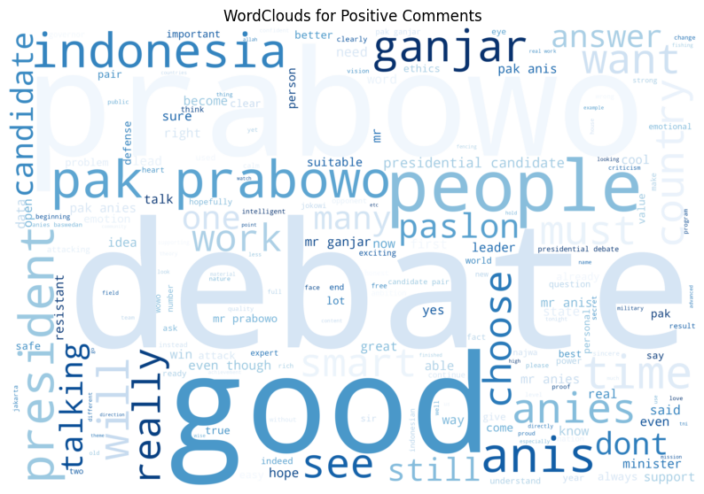
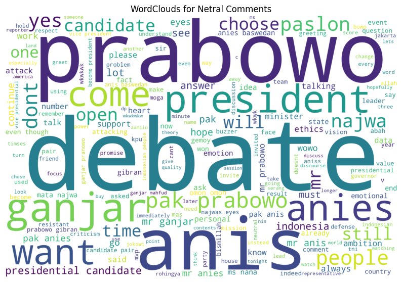
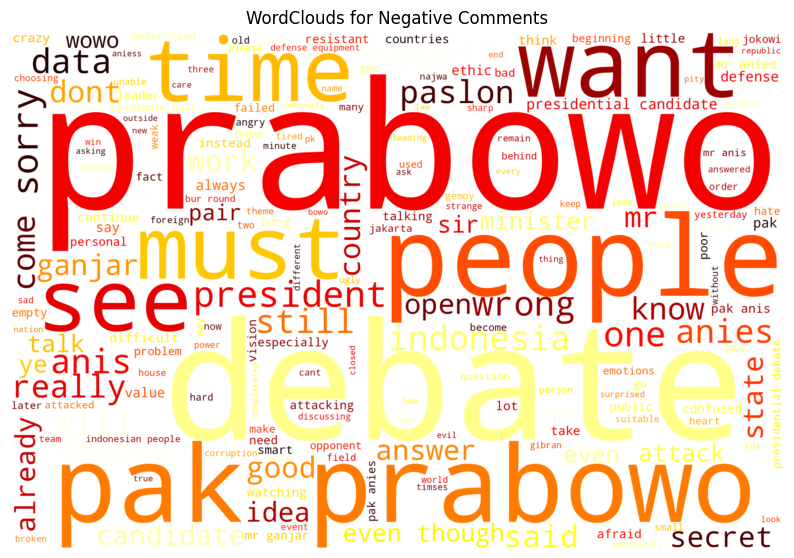
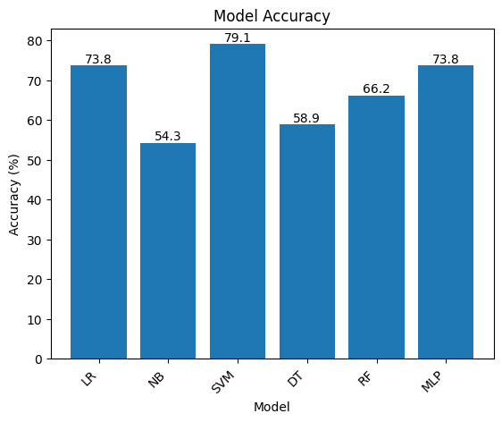
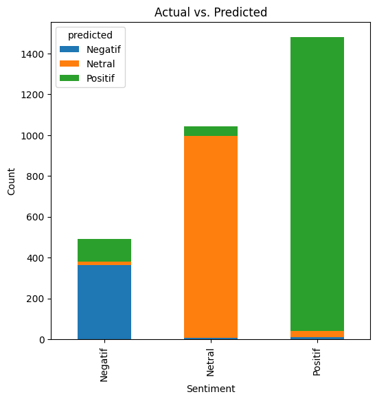

# Sentiment Analysis of Presidential Debate 2024

This repository contains a sentiment analysis of the 2024 presidential debate. The approach used includes several stages, ranging from data scraping, data processing, to machine learning modeling.

## Analysis Stages

### 1. **Data Scraping**: 
Data is obtained by scraping comments from the YouTube video titled "**[LIVE] Debat Capres 2024, Nobar Debat Ronde Ketiga di Musyawarah | Musyawarah**" with [this link](https://www.youtube.com/live/Sbjsg3AFx00?si=VH1y1B9fO2DkGsYL). A total of 3597 comments were successfully collected.

[](https://www.youtube.com/watch?v=Sbjsg3AFx00)

### 2. **Load Scraped Data**: 
The scraped data is loaded into the repository for further processing.

### 3. **Cleaning Data**: 
The data cleaning process is performed to address noise and ensure the quality of the data to be used.

### 4. **Pre-processing**: 
This stage involves text processing, including tokenization, slang normalization, stopword removal, and stemming using **Sastrawi**.

### 5. **Translate**: 
In this stage, the collected comments will undergo a translation process into English. This is done to ensure consistency in sentiment analysis, allowing the algorithm to label positive, negative, or neutral sentiments more accurately.

### 6. **Labelling**: 
Sentiment labels are assigned to comments using the TextBlob algorithm. The labeling results show 1480 positive comments, 1041 neutral comments, and 492 negative comments.

### 7. **Visualization**: 
Visualization is used to provide a better understanding of the distribution of sentiment in the data.
- Wordcloud for positive comments:<br>

- Wordcloud for neutral comments:<br>

- Wordcloud for negative comments:<br>


### 8. **Modelling**: 
Machine learning classification is done using several algorithms, including Logistic Regression (LR), Multinomial Naive Bayes (NB), Linear Support Vector Machine (SVM), Decision Tree (DT), Random Forest (RF), and Multi-Layer Perceptron (MLP).

### 9. **Evaluation**: 
Model accuracy is evaluated, and the results are as follows:





## How to Use

1. Clone this repository.
   ```bash
   git clone https://github.com/bimarakajati/Analisis-Sentimen-Debat-Capres-2024.git
   cd Analisis-Sentimen-Debat-Capres-2024
   ```

2. Install the required packages.
   ```bash
   pip install -r requirements.txt
   ```

3. Explore the notebooks and scripts for each stage of the analysis.

Feel free to contribute or use this repository for further analysis and improvements.